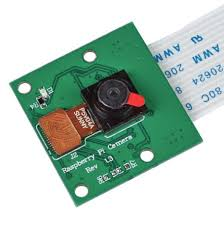
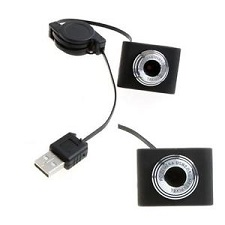

support 2 types of cameras
* raspberry pi camera  

* ebay usb webcam:  



common configuration params
* resolution
* fps
* quality
* timestamp

allow passing additional input configuration params

ensure playing / stopped
* re-run video process in case unexpectedly exited
* kill video process in case unexpectedly did not exit

# API

start streaming video
```
POST /video/stream
```
stop streaming video
```
DELETE /video/stream
```

capture snapshot
```
POST /video/snapshots
```

start recording video
```
POST /video/recording
```

stop recording video
```
DELETE /video/recording
```

